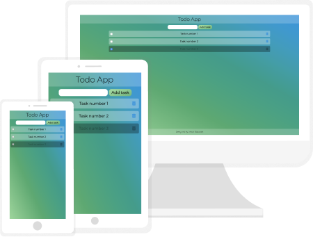

# Todo App

> Todo App with basic functionality like adding and removing tasks and choosing of completed tasks.

## Table of contents
* [Technologies](#technologies)
* [Setup](#setup)
* [Features](#features)
* [Preview](#preview)
* [Status](#status)
* [Contact](#contact)

## Technologies
* HTML5
* CSS3
* JavaScript ES6
* PWA
* npm
* gulp

## Setup
If you want to run my website locally, enter the following commands in console:

`npm install -g gulp-cli`

`npm install`

`gulp`

## Features
List of features ready and TODOs for future development
* adding and removing tasks
* choosing of completed tasks
* storing tasks in local storage
* PWA support

To-do list:
* moving completed tasks to the end of list
* buttons to remove all/completed tasks

## Preview
To live preview of my project visit this website: [Todo App](https://jakub-matusiak.github.io/todo-app/)

## Status
Project is _in progress_

## Contact
Created by [Jakub Matusiak](https://github.com/jakub-matusiak) - feel free to contact me!